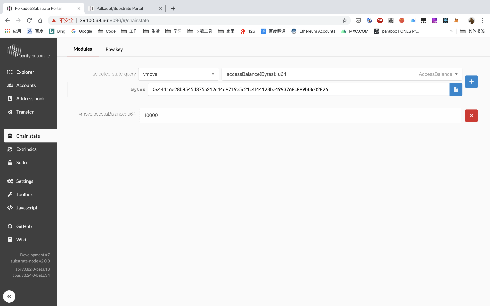

# Move Node

A new SRML-based substrate and libra move engine.

# Building

Install Rust:

```bash
curl https://sh.rustup.rs -sSf | sh
```

Install required tools:

```bash
./scripts/init.sh
```

Developing environment:
In linux and mac: [ref](https://github.com/laddernetwork/substrate#611-linux-and-mac)  
In Windows : [ref](https://github.com/laddernetwork/substrate#612-windows)

Build all native code:

```bash
cargo build
```

# Run

You can start a development chain with:

```bash
cargo run -- --dev --other-execution=Native --syncing-execution=Native --block-construction-execution=Native --importing-execution=Native
```

# Move

You can execute your move program like in the Libra chain. Basic function is transfer coin, high grade function is deploy 
custom program. Here is some demo how to do it.

We also provide a caster tool that makes it easy for users to call the move function.


# Demo
Goto caster directory.
```
cd caster
```


sudo account:

```
privete: 0x4db4ef1992889d4428e400be3428843db6e89bb2e8aaf4ce8efe00df64012544
public: 0x01add5624932fc6e5e82ea4b8b4217c2ea4372a1e4fbc9d910a38b2514931166
address: 0x44416e28b8545d375a212c44d9719e5c21c4f44123be4993768c899bf3c02826
```

Create a new account:
```
cargo run -- account --create
```

```
private: 0x4db4ef1992889d4428e400be3428843db6e89bb2e8aaf4ce8efe00df6401253c
public: 0xd0b56296877f8acefdefef06569751d8587f8f5df255179957086012b4fb7d20
address: 0xb2c5ac79fdc6f4b8159a0500104ec59c99c5413a52423bfb2d23bc43290c6907
```


## Mint
```bash
cargo run -- tx -m mint -k 0x4db4ef1992889d4428e400be3428843db6e89bb2e8aaf4ce8efe00df64012544 -r 0x44416e28b8545d375a212c44d9719e5c21c4f44123be4993768c899bf3c02826 -v 10000 -s 0
```
A move script will be created after execution. use [Substrate explorer](http://39.100.63.66:8096/#/extrinsics) to execute script.


At  [Chain State](http://39.100.63.66:8096/#/chainstate) page, you can see the new account balance.



## Transfer

```bash
cargo run -- tx -m transfer -k 0x4db4ef1992889d4428e400be3428843db6e89bb2e8aaf4ce8efe00df64012544 -r 0xb2c5ac79fdc6f4b8159a0500104ec59c99c5413a52423bfb2d23bc43290c6907 -v 100 -s 0
```
use [Substrate explorer](http://39.100.63.66:8096/#/extrinsics) to execute script.

At  [Chain State](http://39.100.63.66:8096/#/chainstate) page, you can see the new account balance.

## Publish Custom Module
Write your move module.
```
module M {
	public max(a: u64, b: u64): u64 {
		if (copy(a) > copy(b)) {
			return copy(a);
		} else {
			return copy(b);
		}
		return 0;
	}

	public sum(a: u64, b: u64): u64 {
		let c: u64;
		c = copy(a) + copy(b);
		return copy(c);
	}
}
```

To build module
```bash
cargo run -- tx -k 0x4db4ef1992889d4428e400be3428843db6e89bb2e8aaf4ce8efe00df64012544 -m publish --compiled_file ./scripts/m.mvir -s 1
```
use [Substrate explorer](http://39.100.63.66:8096/#/extrinsics) to execute script.

## Call Custom Module
Write your move script to call module.
```
import 0x0.LibraAccount;
import 0x44416e28b8545d375a212c44d9719e5c21c4f44123be4993768c899bf3c02826.M;

main() {
	let a: u64;
	let b: u64;
	let amount: u64;
    let payee:address;

	a = 10;
	b = 2;
	amount = M.sum(copy(a), copy(b));
    payee = 0x1;

    LibraAccount.pay_from_sender(move(payee), move(amount));
    return;
}
```
```bash
cargo run -- tx -k 0x4db4ef1992889d4428e400be3428843db6e89bb2e8aaf4ce8efe00df64012544 -m publish --compiled_file ./scripts/s.mvir -s 2
```
use [Substrate explorer](http://39.100.63.66:8096/#/extrinsics) to execute script.

At  [Chain State](http://39.100.63.66:8096/#/chainstate) page, you can see the new account balance.

